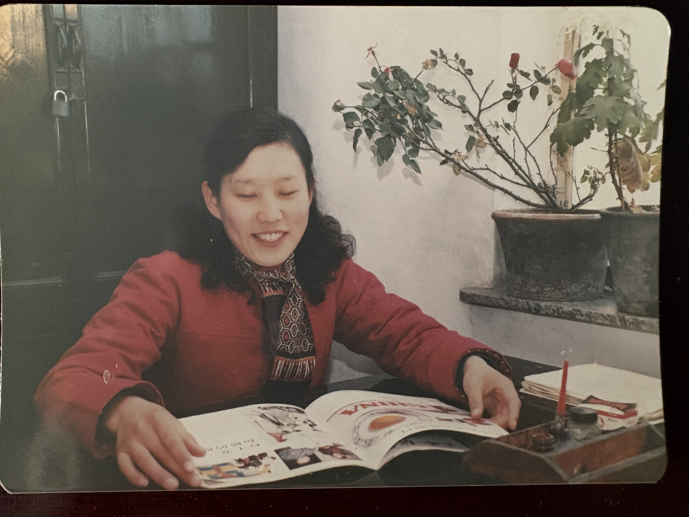
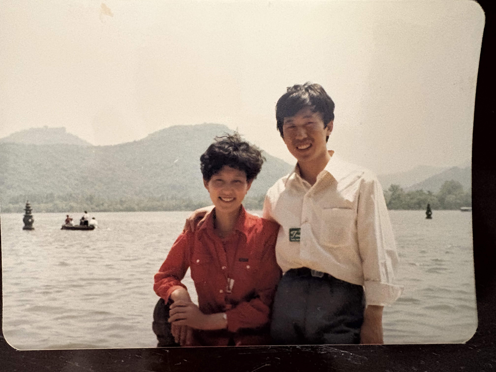

# 愿这个世界记住家慈健康的样子

家慈在与脑胶质瘤勇敢战斗了四年后，于乙巳年农历六月十二仙逝，享年63岁。她在脑胶质瘤患者中是幸运和幸福的：靠谱的老爸在疫情的重重阻拦之下依然为她争取到了最好治疗方案，他这些年不辞劳苦的照顾，使得家慈在确诊后四年里大部分时间还能够做一些自己喜欢的事情。需要感谢的人还有很多，二姨小姨舅舅以及在博山的所有亲人们，天坛医院主刀的姜医生以及他的团队，第一医院/博山区医院肿瘤科的医生及护士们，一直来家里帮家慈做按摩复建的翟护士，还有家慈的闺蜜和舞友们，在此叩首拜谢。

无论怎样安慰和粉饰，“63岁因癌症去世”都是一个无比悲伤的事实，我在奔丧的飞机上开始强迫自己记下一些我记忆中家慈健的日子里的事情，希望这些能够占据我以后的关于她回忆；家慈葬礼上殡仪公司准备的祭文并无不妥，但仔细想来完全错过了家慈人生的高光时刻，这篇文章算是给家慈写个简单的传记，愿这个世界记住她健康的样子。

我的老家在山东省淄博市博山区，这是鲁中山区外围的一个小盆地，从明清时期就已经以陶瓷和琉璃生产出名，20世纪初的时候德国殖民者在这发现了煤矿和铝矿，建国后人们又依托于这些矿产在附近的山里建了各种机械厂或者兵工厂，博山这个小城得以有了一些工业基础。家慈张凤荣女士出生在博山区城中辘辘把街的张家大门。家慈的爷爷是当地小有名气的木匠，我姥爷是家中长子，家慈是姥姥姥爷养育的三女一子中的大姐。家慈出生于1962年，那时三年自然灾害已经过去，家慈小的时候是吃的饱的。不过她不时会用陶盆去附近农村换点地瓜干，也算是出去郊游吧。家慈偶尔会得到姥姥给的一两分钱或者是自己跟伙伴们捡麦穗或者炉渣换的钱去买麦芽糖或者冰棍，这些就是较为难得的甜蜜时刻。此外家慈提及她儿童时期的事情并不多，或者是过于平淡以至于我已经忘了。不过她带我在博山城里走动时，路过一些老房子院子时她会说：这里（曾经/现在）还有几块磨的很光滑的青石板，我以前经常来这里玩滑梯/你要不要现在去滑一下啊？

家慈初中毕业后本来考上了高中，但是她作为家中大姐早早的开始工作帮衬家里。她应该很小的时候就在家里帮姥姥姥爷做电瓷厂额外计件的工作，例如打磨陶瓷电阻的泥胚，以及整理钢丝条。她第一份全职的零时工是在车站的食堂里蒸馍头以及做油饼。她蒸馒头的手法应该是那时候练出来的吧，面团在她手里很快就可以被揉成光滑的面胚，反而我拿着揉面机里和好的面团再折腾五分钟表面还是粗糙的。家慈正式就业是在淄博客车厂（其主营业务是组装大客车或者油罐车），同那个年代大多数人就业一样，她在厂子里并没有什么特别固定的工作，做的比较多的应该是油漆工，她还说自己做过电焊。此外家慈有在工休时间在厂里的广播站播音，那应该是她第一份工作中最开心的部分吧.

家慈在八十年代中期经人介绍认识了我爸，准确的说两人在媒人提供的众多选择中挑中了彼此。对于谈恋爱的这段时间，妈偶尔会回忆起来爸给往妈的单位送过若干略些许尴尬的礼物，两人下班后一起看电影，去舞厅跳舞，在博山附近爬山划船。这些大体是她们那个年代约会的标准流程吧。两人于86年结婚，蜜月旅行去了趟上海加杭州（）。家慈大体对杭州无感，不过对于上海的繁华赞不绝口，她流连于南京路的各种百货，买回来了若干领先于博山两三个时代的服饰。家慈身材高挑，配上这些衣服在博山是模特般的存在（图三）。

在她们结婚一年半以后，我呱呱坠地，我那挑剔的胃口和乳腺炎在最初一两年着实给了家慈一些麻烦。好在断奶之后我应该是算乖的小孩吧，家慈在带我之前已经通过她大姐的角色有了不少带娃的经验。她偶尔将我和我舅叫混，小的时候不太理解，我和我舅的名字并不接近，后来才明白我应该算是她带过的第二个小孩。她带我和后来帮我和嘉韵带希希都是手拿把掐。例如我中午不想睡觉，她一般都说没事，我先夹着你退躺一会，然后等我再有意识的时候就要飞奔去上学了。想来这辈子我跟她大部分的争吵的原因都是：你怎么又不叫醒我，我又要在众目睽睽下迟到了。然后她一般都说：我看你睡的那么香，晚到一会没什么。她较少辅导我功课，不过一直会给我一个非常安静的环境让我学习，例如她在我上学期间从不在我在家期间看电视。我从我中学开始她会一直早起砸核桃帮我补脑，这个习惯成为了楼道里的闹钟，以至于我上大学离开家之后楼下几位邻居需要自己重新定闹钟非常不习惯。

还是说回她工作上的事情吧，她在91年左右从客车厂调动到了淄博陶瓷琉璃供销社（后更名为淄博陶瓷琉璃总公司）。她刚调去的几年这个供销社运营的还可以，家慈根据单位需要做着会计，采购，点货等若干工作。此间的高光时刻是她曾经坐着火车到了祖国最北角的漠河，为单位淘到了一批优质木材，顺路感受了一下四月份的北国风光（看照片应该还是挺冷的）。此后供销社的生意随着改革开放的大潮渐渐失去了它存在的价值，家慈也在这大潮中光荣下岗。其实以我爸的收入加上两人节俭的生活方式，家慈应该可以不用工作的，但是，她不想失去收入，不想闲着。在我大伯的引荐下她在博山客运站（旧的那个在博山火车站前面那个）附近开了一间保健品商店，她和我爸给它起名为“生力”，原意是这些保健品可以帮顾客们生出力量，但我觉得这是家慈自力更生的门道。它一开始的主营业务是卖脑白金，xx补脑液之类的初代爆款保健品，不过后来家慈发现这家小店的位置更适合为来往的旅人提供便利，她逐渐添加了公用电话，香烟，饮料，雪糕，雨伞等。这家保健品店逐步变成了一间便利店。“店”其实并不是对这个空间准确的描述，它是在一根大圆水泥柱和建筑外墙间用铝合金门窗隔出来的大约4米长，2米宽，挑高超过4米的棚子，里面放着一排柜台，外面放着卖饮料的冰柜。外面的放冰箱的空间是家慈她们努力同其他商贩努力“协商”占下来的。棚子里面的空间冬冷夏热，残破的铝合金门窗冬天呼呼透风，超高的挑高使得任何取暖措施失效，到了夏天那里全是玻璃又变成了一个温室。家慈在这样环境里经营了十几年（大约是我小学四年级到本科毕业吧），赚到的钱也就是博山一个普通工人的工资，不过好在这个小买卖也有雇佣家里其他下岗亲戚帮忙，也给了他们一份收入。

熟悉小商贩如何运作的朋友应该清楚这么一个小店，雇佣其他员工纯粹是摊薄主家本不丰厚的收入，不过家慈依然选择这样是为了她能在中午和晚上回家给我做饭。我出于青少年社交的需求非常想要跟同学一起在学校吃食堂或者是校门外的小摊，不过都被家慈和我爸严厉拒绝，他们给出的理由大体是没有营养，地沟油，不卫生之类。当然拒绝的手段除了讲道理之外，他们干净利落的停掉了我的零花钱（我从小学到高中身上基本没有任何钱）。我初中离家略远，他们为了给我做饭直接在学校附近租了一间小房子专门吃午饭和午休。现在想来这些保证了全天我精力充沛的上课或者自习，然后每天下午晚上快走或者狂奔回学校也多多少少有锻炼效果吧。

这个“生力”小店的经营随着我本科毕业靠奖学金出国画上了完美的句号，那个时候家慈也开始领退休金算是有收入了。不过客观的说，如果不是博山客运站搬走了，小店的客流量被脚踝斩的话，家慈应该会继续经营吧。因为她把这个小店脱手后短暂的沉迷了一会十字绣打发时间，没过多久就跑去我高中母校做起了宿管阿姨。这份工作的工作量大，压力还不小，除了要打扫卫生，查寝落锁，万一有学生翻墙出去玩还得跟学校的老师一起出去找，但是产生的收入只能说是聊胜于无。我此刻已经感受到家慈不甘做家庭退休妇女的心，也只能不停的告诉她，你能不能找个更好一点的工作，或者上个老年大学，在或者学点英语？

大约做了一年宿管，家慈的工作随着我爷爷奶奶的衰老和我姥姥的生病戛然而止，

希希也是在这段时间里出生的，家慈的担子又多了一些。家慈来加拿大帮我们带希希的日子大体是要比在国内伺候老人要轻松一些的，她来过三轮，最后一次2021年来还见证了我们装修房子。渐次